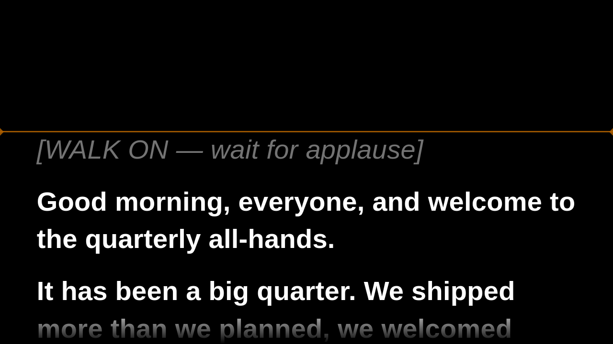
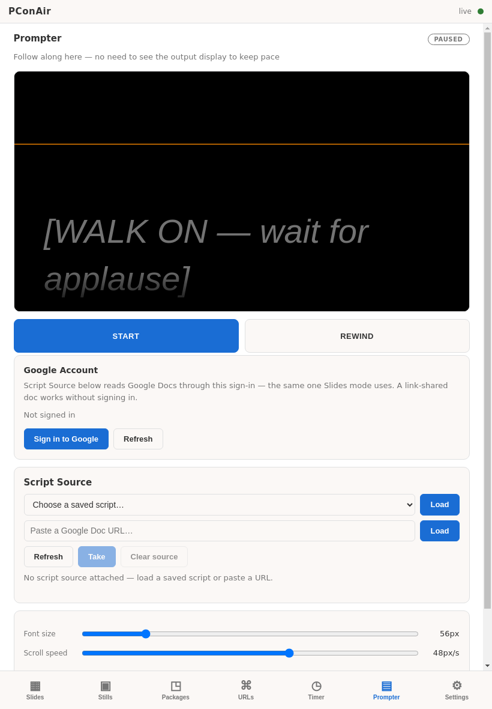
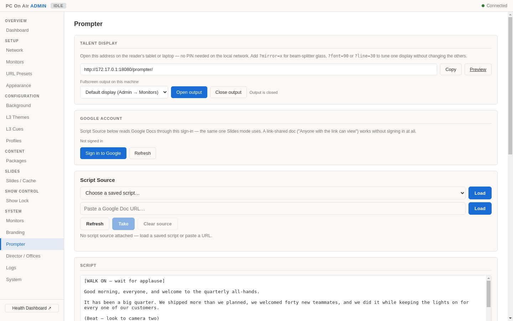
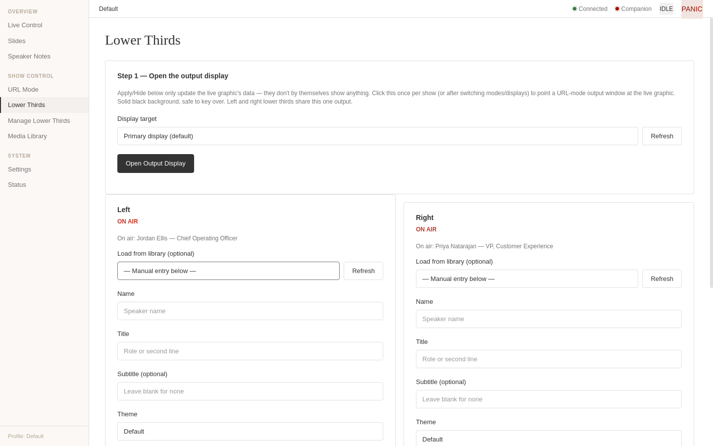
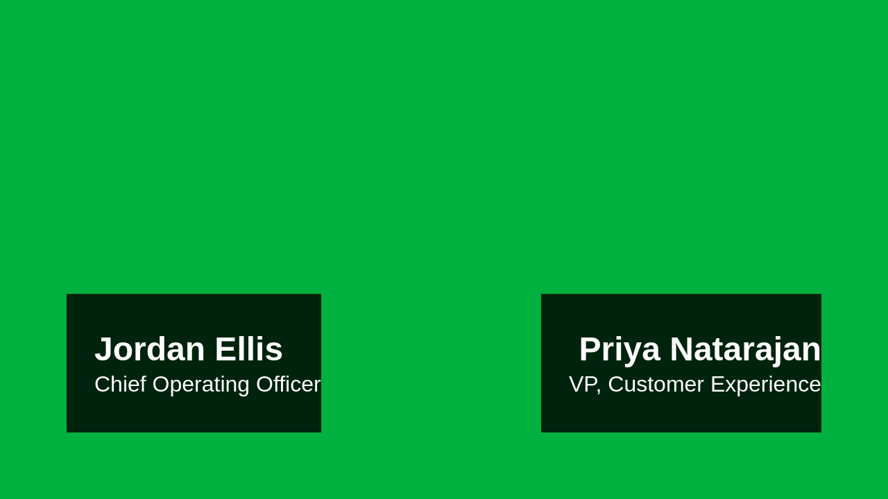
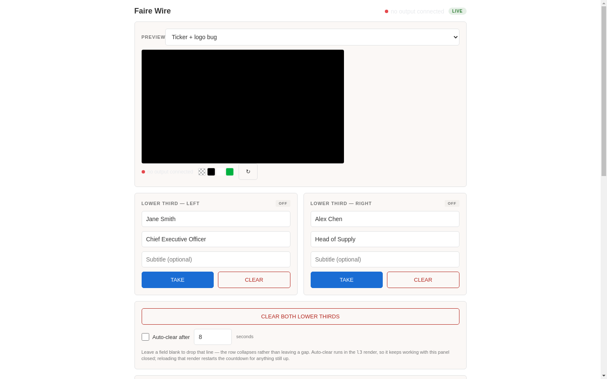

# PC On Air

> **Status: Beta — in live use.** v0.5.0 ran the prompter for a live show in September 2026; not every feature has been through a full show yet.

PC On Air (PConAir) is an Electron playout app for live events. One machine drives Google Slides, live URLs, a still store, lower thirds, HTML graphics packages and a talent prompter, all controllable from a browser, a tablet or Bitfocus Companion.

It is the successor to [Google Slides Controller](https://github.com/TomsFaire/google-slides-controller) (GSC), and still answers GSC's HTTP API so existing Companion buttons keep working.



---

## What it does

| Area | What you get |
|------|--------------|
| **Slides** | Load Google Slides decks with next/prev/goto/reload, A/B primary–backup failover, speaker notes window, thumbnails, offline mode |
| **URL** | Any live URL fullscreen (Slido, dashboards, web apps). A/B instances with independent reload, per-display routing, URL preset library |
| **Media Library** | Still store with operator uploads (incl. HEIC and video), take/clear, cut/fade transitions, slideshows with shuffle |
| **Lower thirds** | Independent left and right lower thirds, a cue library with CSV import, CSS themes, a logo library, and transparent PNG export for ATEM/vMix still stores |
| **Graphics packages** | Drop-in HTML graphics (bundled: Faire Wire news, FFG, Hoops scorebug) with their own control pages, render pages for OBS/vMix browser sources, and auto-generated Companion controls. See [docs/designing-packages.md](docs/designing-packages.md) |
| **Prompter** | Talent display at `/prompter/` for tablets, glass rigs or a fullscreen output, with mirroring, markers and signed speed. Scripts can be typed in or pulled from a **Google Doc**; new doc versions wait for an explicit operator **Take**. See [docs/prompter.md](docs/prompter.md) |
| **Stagetimer** | stagetimer.io overlay pinned over a corner of the speaker notes |
| **Remote access** | Built-in Cloudflare tunnel (quick or named) with an optional access PIN and an on-screen QR code |

**Show-safety and operations:**
- Operator/admin PIN split, session lockout and rate limiting, IP allowlist, security headers
- Show Lock (freeze admin changes mid-show) and a Panic toggle (blank everything)
- Keyed output for every render page: transparent, luma black/white, chroma or opaque
- Primary/backup mode: a primary machine fans every command out to backup machines
- **Director:** one app controlling several PConAir machines ("offices")
- Show profiles: presets, cues, themes and settings as a portable zip with backups and restore
- Health dashboard, watchdog, and a tray menu showing the PINs and quick links

### Screenshots

| | |
|---|---|
|  |  |
| **Remote** (`/remote/`): phone and tablet control. The Prompter tab follows the script live | **Admin → Prompter**: talent display link, fullscreen output, Google Doc script source |
|  |  |
| **Operator → Lower Thirds**: left and right cards fired independently | **Render output** (`/render/l3?bg=chroma`), ready to key |



*Package control page (`/packages/news/control`) for the bundled Faire Wire news graphics.*

---

## Web surfaces

All served by the app on port `8080`, reachable from any device on the network.

| Path | Who it's for | Auth |
|------|--------------|------|
| `/operator/` | Show operator: live control, slides, URL, lower thirds, media | Operator PIN |
| `/remote/` | Phone and tablet remote: slides, stills, packages, URLs, timer, prompter | Operator PIN |
| `/prompter-control/` | Tablet-focused prompter control | Operator PIN |
| `/admin/` | Setup and configuration: network, monitors, presets, themes, profiles, packages, prompter, director | Admin PIN |
| `/admin/health` | Health dashboard | Admin PIN |
| `/prompter/` | The talent's read display | None on the local network |
| `/render/:type`, `/packages/:id/render/:renderId` | Browser sources for OBS/vMix | None |
| `/packages/:id/control` | Per-package control page | Page is open; its actions need an operator session |

---

## Download

Releases are built by GitHub Actions whenever a `v*` tag is pushed. Each [release](https://github.com/ReynoldsProductions/PConAir/releases) has:

- `PConAir-<version>-arm64.dmg`: macOS, Apple Silicon (the primary target)
- `PConAir-win32-x64-<version>.zip`: Windows x64

Both bundle `cloudflared` for the tunnel.

---

## Running from source

```bash
npm install
npm start          # electron-forge start (dev build + launch)
npm test           # vitest run (1,206 tests across 78 files)
npm run typecheck  # tsc --noEmit
npm run build      # electron-forge make (packaged installers in out/make/)
```

### PINs and startup options

PINs come from CLI flags or environment variables. There is no `.env` file.

| Setting | CLI flag | Env var | Default |
|---------|----------|---------|---------|
| Operator PIN (≥4 chars) | `--operator-pin` | `PCONAIR_OPERATOR_PIN` | `0000` |
| Admin PIN (≥8 chars, must differ) | `--admin-pin` | `PCONAIR_ADMIN_PIN` | `00000000` |
| HTTP/WS port | — | `PCONAIR_PORT` | `8080` (also settable in Settings) |

**Change the default PINs before a show.** The tray menu shows the active PINs.

Other flags: `--operator-session-timeout`, `--admin-session-timeout`, `--clear-allowlist` (recovery if the IP allowlist locks you out), `--trust-forwarded-for`.

App settings (tunnel, stagetimer, branding, prompter host, primary/backup mode, director offices) are stored in the Electron user-data folder and edited from **Settings…** in the tray or from Admin.

---

## Project structure

```
src/
  main/                   Electron main process
    routes/               Express routers, one per resource group (incl. gsc-compat.ts)
    slides/  url/  media-library/  l3/      Content modes and their window managers
    prompter/             Prompter state, Google Doc source, doc watcher, script library
    packages/             Graphics package loader, state hub, transport, data sources
    graphics/             Built-in graphics presets
    profiles/             Show profiles: schema, zip export/import, backups
    director/             Multi-machine Director (office clients)
    stagetimer/  tunnel/  security/  services/
    action-dispatch.ts    Shared action dispatcher (WebSocket, /api/action, Companion)
    auth.ts               PIN sessions, rate limiting, lockout
  renderer/
    operator/  remote/  admin/  prompter-control/  settings/  director/
  runtime/                Runtime served to graphics packages
  shared/types.ts         Shared state and API types
bundled-packages/         Graphics packages shipped with the app (news, ffg, hoops)
demo-packages/            Example and template packages
graphics/                 Standalone query-param HTML templates (see graphics/README.md)
packages/companion-module-pconair/   Bitfocus Companion module
specs/                    Design specs 00–23 (source of truth)
docs/                     Guides: prompter, designing packages, exporting graphics, latency
tests/                    Vitest suites
```

Start with [`specs/02-api-state-contract.md`](specs/02-api-state-contract.md) (HTTP API and state contract) and [`specs/11-implementation-status.md`](specs/11-implementation-status.md).

---

## API

HTTP and WebSocket on the same port. Authenticate with a PIN to get a session cookie:

```
POST /auth/operator   { "pin": "..." }   → operator session
POST /auth/admin      { "pin": "..." }   → admin session
```

Selected endpoints:

```
GET  /api/status                       Full application state
GET  /api/health                       Health check
POST /api/mode                         Switch mode: slides | url | media-library | idle
POST /api/ab/switch                    Flip the active A/B instance
POST /api/panic                        Panic toggle
POST /api/show-lock                    Arm/take show lock
GET  /api/displays                     Available displays

POST /api/slides/load | next | prev | goto | reload
POST /api/url                          Load a URL          POST /api/url/reload
GET  /api/presets                      URL presets
POST /api/media-library/take | clear | slideshow
GET  /api/l3/cues                      Lower-third cue library
POST /api/background                   Live background (luma/solid or preset)
GET  /api/profiles                     Show profiles       POST /api/profiles/:id/activate

POST /api/prompter/start | stop | toggle | rewind | speed | script
POST /api/prompter/doc/load | refresh | take | clear      Google Doc script source
GET  /api/packages                     Graphics packages   POST /api/packages/:id/state

POST /api/action                       Any dispatcher action, e.g.
                                       { "action_id": "lower_third_apply",
                                         "params": { "side": "left", "name": "…", "title": "…" } }

POST /api/next-slide, /api/open-presentation, …      GSC-compatible endpoints
```

Full contract: [`specs/02-api-state-contract.md`](specs/02-api-state-contract.md).

---

## Bitfocus Companion

The module is in [`packages/companion-module-pconair/`](packages/companion-module-pconair/). It has **111 actions, 158 variables, 45 feedbacks and 54 presets**, plus one Load preset per saved prompter script and controls generated from each graphics package's manifest.

Install it through Companion's developer module path (point at the parent folder), or install the packaged `.tgz`. Configure:

- **Host**: IP of the PConAir machine
- **Port**: default `8080`
- **Operator PIN (optional)**
- **HTTP Polling Interval (ms)**: fallback if the WebSocket drops (default 1000)

It connects over WebSocket with exponential-backoff reconnection and falls back to HTTP polling.

---

## Licence

Private — all rights reserved.
